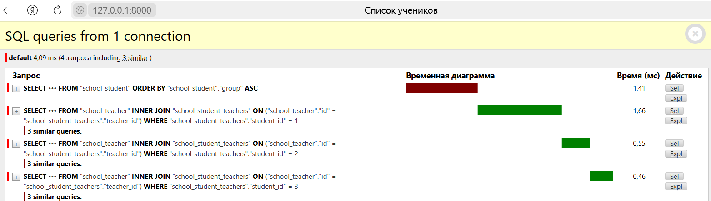

# Анализ количество SQL-запросов
Без использования prefetch_related - 4 запроса

С использование prefetch_related - 2 запроса

prefetch_related позволяет получить связанные объекты с помощью одного SQL-запроса с использованием оператора JOIN, вместо трёх запросов.
